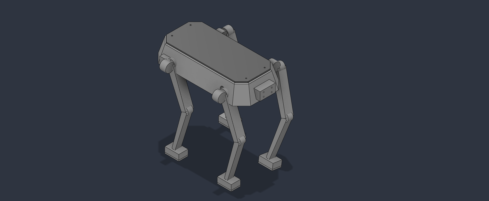
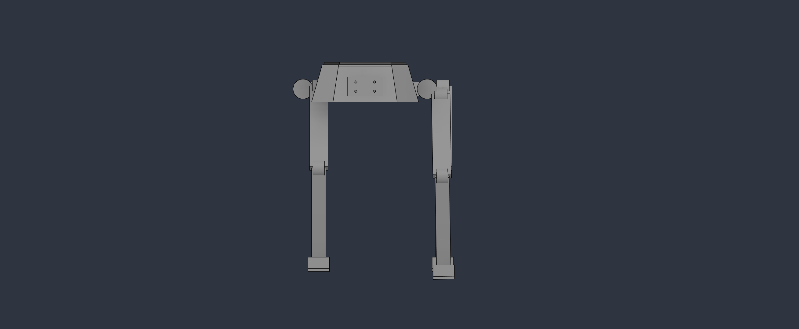
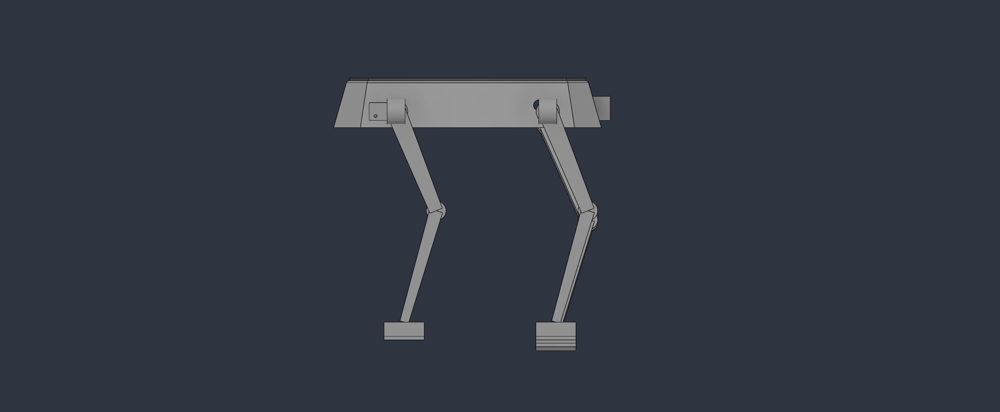
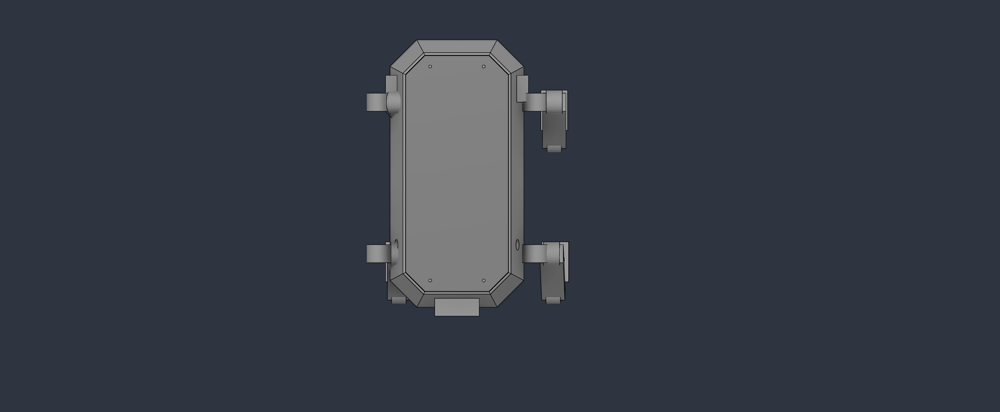

# 12-DOF Quadruped Robot
### Mechanical Design · Engineering Analysis · Parametric CAD · Digital Manufacturing

A complete mechanical design study of a **12-DOF quadruped robotic platform**, developed from the initial engineering concept through mechanical analysis, CAD implementation, and manufacturing-ready STL export.

The project focuses on the fundamental mechanical principles required for a quadruped robot to stand and support future walking implementation, including chassis architecture, articulated leg design, degrees of freedom, actuator sizing, joint torque estimation, stability, center-of-gravity considerations, gait selection, and expected mechanical challenges.

The mechanical concept was transformed into a complete editable CAD assembly using **Autodesk Fusion**, then prepared for manufacturing through individual STL exports and documented in this repository.

<p align="center">
  
</p>

---

## Project Overview

The goal of this project is to develop a mechanically understandable, modular, and manufacturable quadruped robot rather than an unnecessarily complex robotic platform.

The final design consists of:

- 4 articulated legs
- 3 rotational Degrees of Freedom per leg
- **12 DOF total**
- Modular leg architecture
- Central structural chassis
- Low and centralized battery tray
- Removable top cover
- M3 fastening features
- Front sensor mounting interface
- Replaceable foot pads
- Separate manufacturing parts
- Editable Autodesk Fusion source model
- Individual STL files for fabrication

### Design Philosophy

The project prioritizes:

**Modularity · Stability · Manufacturability · Maintainability · Mechanical Simplicity · Sensor Flexibility**

---

# 1. Mechanical Architecture

The robot uses a four-legged quadruped configuration built around a central chassis.

The chassis provides the primary structural platform for:

- Leg attachment
- Battery placement
- Future control electronics
- Power electronics
- Sensor integration
- Future experimental payloads

The design intentionally avoids decorative animal features such as a head or tail.

Instead, the robot is treated as a **functional mobile robotic platform** whose geometry is driven primarily by mechanical requirements.

---

# 2. Chassis Design

The chassis was designed as a compact structural frame with approximately:

| Parameter | Approximate Value |
|---|---:|
| Length | 310 mm |
| Width | 160 mm |
| Overall chassis height | ≈ 75 mm |
| Structural wall | ≈ 4 mm |
| M3 clearance holes | 3.4 mm |

The chassis incorporates:

- Main structural frame
- Internal electronics space
- Central battery tray
- Removable top cover
- Four leg interfaces
- Front sensor mounting interface
- M3 fastening locations

The geometry uses a restrained angular profile rather than a simple solid rectangular box, providing a more functional robotic structure while keeping the CAD reliable and manufacturable.

---

# 3. Leg Design

The robot contains four mechanically similar leg modules.

Each leg contains:

```text
Hip Roll
   │
Hip Pitch
   │
Upper Link
   │
Knee
   │
Lower Link
   │
Foot
   │
Foot Pad
```

Approximate dimensions:

| Component | Approximate Dimension |
|---|---:|
| Upper Link | 118 mm |
| Lower Link | 128 mm |
| Foot | 45 × 30 × 16 mm |

The upper and lower links were designed as structural mechanical members rather than simple rods.

The modular leg architecture also allows repeated components to be manufactured from the same STL geometry.

---

# 4. Degrees of Freedom

Each leg contains **three rotational Degrees of Freedom**.

## Hip Roll

Provides lateral movement of the leg.

This joint represents:

**Abduction / Adduction**

and allows the leg to move away from or toward the robot body.

## Hip Pitch

Provides forward and backward motion of the upper leg.

This joint contributes significantly to:

- Step length
- Forward motion
- Body positioning

## Knee Pitch

Controls bending and extension of the lower leg.

This joint is responsible for:

- Foot lifting
- Leg extension
- Ground clearance
- Standing-height adjustment

Therefore:

```text
3 DOF per leg × 4 legs = 12 DOF
```

### Final Architecture

**12-DOF Quadruped Robot**

---

# 5. Preliminary Joint Motion Ranges

The mechanical architecture was developed around approximate revolute-joint ranges suitable for a preliminary quadruped design.

| Joint | Preliminary Motion Range |
|---|---:|
| Hip Roll | -35° to +35° |
| Hip Pitch | -70° to +90° |
| Knee Pitch | 0° to 130° |

These limits provide a starting point for standing and walking studies while reducing the risk of unrealistic joint motion.

Final limits should be validated after integrating the exact physical actuators.

---

# 6. Preliminary Actuator Selection

Quadruped joints require controlled angular positioning.

For this reason, a **servo actuator** is more appropriate for the preliminary design than a continuously rotating DC motor.

The proposed actuator category is:

## High-Torque Digital Metal-Gear Servo

Preliminary target requirements:

| Parameter | Target |
|---|---|
| Actuator type | Digital Servo |
| Gear system | Metal Gear |
| Angular position control | Required |
| Preliminary torque target | ≥ 35 kg·cm |
| Preferred design range | 35–40 kg·cm |
| Quantity | 12 |

Using a common actuator class across the twelve joints can simplify:

- Mechanical mounting
- Electrical architecture
- Control software
- Maintenance
- Spare-part management
- Future replacement

> The actuator specification is preliminary. Final servo selection requires physical testing, power analysis, dynamic load analysis, and exact servo mounting dimensions.

---

# 7. Preliminary Joint Torque Calculation

A preliminary torque calculation was performed for the **Knee Pitch joint**.

The basic relationship is:

```text
τ = F × r
```

where:

```text
τ = Joint torque
F = Applied force
r = Distance from the rotational axis
```

## 7.1 Robot Weight

The CAD model produced a conservative solid-body mass estimate of approximately:

```text
m = 3.71 kg
```

Using:

```text
g = 9.81 m/s²
```

the gravitational force is:

```text
W = m × g

W = 3.71 × 9.81

W ≈ 36.4 N
```

The **3.71 kg value is a conservative CAD estimate**, not an expected final printed robot mass.

Real FDM components are normally manufactured using partial infill and would typically weigh less than equivalent fully solid CAD bodies.

---

## 7.2 Supporting-Leg Load

For the proposed crawl gait, one leg may be lifted while the other three support the robot.

A simplified equal-load assumption gives:

```text
F = 36.4 / 3

F ≈ 12.13 N
```

Therefore, each supporting leg carries approximately:

```text
12.13 N
```

under this simplified quasi-static condition.

---

## 7.3 Knee Torque

The lower-link length is approximately:

```text
r = 128 mm
r = 0.128 m
```

Therefore:

```text
τ = F × r

τ = 12.13 × 0.128

τ ≈ 1.55 N·m
```

This represents a simplified static estimate.

---

## 7.4 Safety Factor

A preliminary safety factor of:

```text
SF = 2
```

is applied.

Therefore:

```text
τ_design = 1.55 × 2

τ_design ≈ 3.11 N·m
```

Converting approximately to the unit commonly used for robotic servos:

```text
3.11 N·m ≈ 31.7 kg·cm
```

A reasonable preliminary actuator target is therefore:

## ≥ 35 kg·cm

This provides additional margin for effects that are not represented in the simplified static calculation, including:

- Link self-weight
- Acceleration
- Joint friction
- Foot-ground impact
- Manufacturing tolerances
- Uneven load distribution
- Dynamic motion

---

# 8. Stability & Center of Gravity

Static stability is a critical consideration in quadruped design.

The robot is most stable when the projected center of gravity remains inside the polygon created by the supporting feet.

Several design decisions were made to improve stability.

## Low Battery Placement

The battery tray is located close to the geometric center of the chassis and as low as reasonably possible.

This helps:

- Lower the center of gravity
- Reduce tipping tendency
- Improve weight distribution
- Improve standing stability

## Centralized Mass

Heavy components should remain near the center of the chassis whenever possible.

Large masses mounted high or far from the robot center could shift the center of gravity and reduce stability.

## Four-Leg Support

When all four feet contact the ground, they create a relatively large support polygon.

The projected center of gravity should remain inside this area.

## Three-Leg Support

During crawl walking, one foot is lifted.

The remaining three feet create a triangular support region.

Before lifting a leg, the body should shift sufficiently so that the projected center of gravity remains inside this triangle.

This approach produces a **quasi-static walking strategy** that prioritizes stability rather than speed.

---

# 9. Proposed Walking Method

The initial walking strategy proposed for this platform is:

## Static Crawl Gait

A crawl gait is suitable for an early quadruped prototype because three legs remain in contact with the ground while the fourth leg moves.

One possible stepping sequence is:

```text
Front Left
     ↓
Rear Right
     ↓
Front Right
     ↓
Rear Left
     ↓
Repeat
```

For each step:

1. Three feet remain on the ground.
2. The body weight shifts toward the supporting legs.
3. The projected center of gravity is kept inside the support triangle.
4. One leg is lifted.
5. The leg moves toward its next position.
6. The foot returns to the ground.
7. The sequence continues with the next leg.

The initial goal is therefore:

**Stable walking before fast walking.**

Once a physical prototype achieves reliable crawl locomotion, a more dynamic gait such as **trot** could be investigated.

---

# 10. Expected Mechanical Challenges

Several mechanical challenges are expected during physical implementation.

## Servo Torque & Heating

Operating actuators near their maximum torque for extended periods may cause:

- Heating
- Reduced performance
- Increased power consumption
- Servo stall

The preliminary torque calculation therefore includes additional design margin.

## Joint Backlash

Mechanical clearance inside servo gear trains can introduce backlash.

This can reduce:

- Joint positioning accuracy
- Foot-position accuracy
- Walking repeatability

## Structural Flexibility

Long FDM-printed links may bend under load.

Structural performance will depend on:

- Material
- Infill
- Wall thickness
- Layer orientation
- Printing parameters
- Joint loads

## Foot Slipping

Rigid printed feet may provide insufficient friction on smooth surfaces.

The separate `Foot_Pad` component allows future use of a higher-friction material such as TPU or rubber.

## Manufacturing Tolerances

FDM printing introduces dimensional variation.

Critical areas include:

- M3 holes
- Joint interfaces
- Mechanical clearances
- Actuator mounting regions
- Cover alignment

## Joint Collision

Joint limits must prevent:

- Link-to-chassis collisions
- Leg self-collision
- Excessive joint rotation

## Cable Routing

Twelve actuators require significant wiring.

The wiring should remain protected from:

- Moving joints
- Ground contact
- Sharp edges
- External snagging

Cable routing can be refined further after the final actuator and electronics layout are selected.

## Weight Distribution

Battery, electronics, sensors, and payloads can shift the robot's center of gravity.

Future hardware integration should therefore preserve centralized mass distribution whenever possible.

---

# 11. Parametric CAD Implementation

The mechanical concept was transformed into a complete 3D CAD assembly using:

## Autodesk Fusion

Autodesk Fusion was used as the project's feature-based mechanical CAD environment.

The design includes:

- Sketch-based geometry
- Dimensioned features
- Separate components
- Assembly structure
- Revolute joints
- Editable design timeline
- Manufacturing mesh export
- Mass-property inspection
- Interference inspection

The editable Fusion archive is included with the project.

---

# 12. CAD Component Architecture

The project was organized around a modular component structure:

```text
Quadruped Robot
│
├── Chassis
│   ├── Main Frame
│   ├── Battery Tray
│   └── Top Cover
│
├── Leg Module ×4
│   ├── Hip Roll
│   ├── Hip Pitch
│   ├── Upper Link
│   ├── Knee
│   ├── Lower Link
│   ├── Foot
│   └── Foot Pad
│
└── 12-DOF Mechanical Architecture
```

The leg architecture is reused across all four corners rather than designing four unrelated legs.

This improves:

- Modularity
- Symmetry
- Maintainability
- Manufacturing consistency
- Design reuse

---

# 13. Removable Top Cover

The robot includes an independent top cover following the chassis geometry.

The cover includes four M3 clearance locations.

The removable design provides:

- Electronics access
- Easier maintenance
- Battery/electronics inspection
- Faster future modification

The exported manufacturing geometry is provided as:

```text
Top_Cover.stl
```

---

# 14. Battery Integration

The battery tray is designed as an independent mechanical component positioned low and centrally inside the chassis.

The design strategy reserves the region above the battery for future systems such as:

- Microcontroller
- Power electronics
- Motor-control electronics
- Custom PCB
- Communication hardware

This arrangement helps maintain a lower center of gravity.

---

# 15. Sensor Integration

The chassis includes a front mechanical mounting interface for future perception hardware.

Potential modules include:

- Distance sensors
- ToF sensors
- Camera
- Depth camera
- Stereo camera
- Compact LiDAR
- Embedded vision systems

The sensors themselves were intentionally not modeled.

Instead, the mechanical platform provides an interface for future integration without requiring redesign of the complete chassis.

---

# 16. Foot Design

Each leg terminates in two components:

```text
Structural Foot
      +
Replaceable Foot Pad
```

The structural foot provides the main load path.

The separate foot pad allows future experimentation with different ground-contact materials.

A future physical prototype could manufacture the pad using:

- TPU
- Rubber-like material
- High-friction polymer

This provides a simple method for improving ground traction without redesigning the entire leg.

---

# 17. Manufacturing Strategy

The robot is designed with FDM additive manufacturing in mind.

The mechanical design emphasizes:

- Separate printable components
- Moderate wall thickness
- Accessible fasteners
- Replaceable parts
- Simple structural geometry
- Limited unnecessary decorative features
- Practical component assembly

Instead of exporting the complete robot as one fused mesh, the unique mechanical components are exported separately.

This improves:

- Print orientation
- Component replacement
- Repairability
- Manufacturing flexibility
- Iterative prototyping

---

# 18. STL Manufacturing Files

The final design contains **10 unique manufacturing geometries**.

| STL File | Required Quantity | Function |
|---|---:|---|
| `Main_Frame.stl` | 1 | Primary structural chassis |
| `Battery_Tray.stl` | 1 | Low central battery support |
| `Top_Cover.stl` | 1 | Removable chassis cover |
| `Hip_Roll.stl` | 4 | Lateral hip joint structure |
| `Hip_Pitch.stl` | 4 | Forward/backward hip joint structure |
| `Upper_Link.stl` | 4 | Upper structural leg link |
| `Knee.stl` | 4 | Knee joint structure |
| `Lower_Link.stl` | 4 | Lower structural leg link |
| `Foot.stl` | 4 | Structural ground-contact foot |
| `Foot_Pad.stl` | 4 | Replaceable contact pad |

### Manufacturing Summary

```text
10 unique STL geometries
31 physical mechanical components
```

The reusable leg architecture means repeated parts only require one unique STL file.

All STL files are located in:

```text
STL/
```

---

# 19. CAD Design Views

## Isometric View

<p align="center">
  
</p>

---

## Front View

<p align="center">
  
</p>

---

## Side View

<p align="center">
  
</p>

---

## Top View

<p align="center">
  
</p>

---

# 20. Editable CAD Design

The complete editable Autodesk Fusion archive is included in:

```text
CAD/Quadruped_Robot_Final_Submission.f3d
```

### Autodesk Fusion Shared Design

[View / Download the Autodesk Fusion Design](https://a360.co/3Sg3Qcz)

Download access is enabled on the shared design.

A copy of the design-link information is also stored in:

```text
Documentation/Design_Link.txt
```

The repository therefore provides:

- Editable `.f3d` source model
- Fusion design history
- Shared browser-accessible design
- Download-enabled Autodesk link
- Individual STL manufacturing files
- CAD visualization images

---

# 21. Tools & Engineering Workflow

## Autodesk Fusion

Autodesk Fusion was used as the primary mechanical CAD environment for:

- Mechanical CAD modeling
- Component creation
- Assembly development
- Revolute-joint definition
- Design refinement
- Mass estimation
- Interference inspection
- STL generation
- Editable design archive

---

## Claude + Autodesk Fusion Integration

Claude was incorporated into the development process through an **AI-assisted CAD workflow connected to Autodesk Fusion**.

The integration supported:

- Repetitive CAD operations
- Component inspection
- Assembly auditing
- Joint verification
- Geometry review
- Dimensional checking
- Interference review
- Iterative CAD refinement
- Design-review assistance

The engineering requirements, mechanical architecture, constraints, acceptance criteria, and final design decisions were reviewed throughout the workflow.

AI assistance was used to accelerate CAD iteration and inspection while maintaining the project's mechanical requirements and design objectives.

---

# 22. Repository Structure

```text
quadruped-robot-mechanical-design/
│
├── CAD/
│   └── Quadruped_Robot_Final_Submission.f3d
│
├── Documentation/
│   └── Design_Link.txt
│
├── Images/
│   ├── 01_Isometric_View.png
│   ├── 02_Front_View.png
│   ├── 03_Side_View.png
│   └── 04_Top_View.png
│
├── STL/
│   ├── Battery_Tray.stl
│   ├── Foot.stl
│   ├── Foot_Pad.stl
│   ├── Hip_Pitch.stl
│   ├── Hip_Roll.stl
│   ├── Knee.stl
│   ├── Lower_Link.stl
│   ├── Main_Frame.stl
│   ├── Top_Cover.stl
│   └── Upper_Link.stl
│
└── README.md
```

---

# 23. Current Limitations

This project represents a **preliminary mechanical engineering design** rather than a production-ready quadruped robot.

Current limitations include:

- The final commercial servo model has not yet been selected and experimentally validated.
- Torque sizing is based on a simplified quasi-static model.
- Dynamic impact loads have not yet been experimentally measured.
- Servo-specific mounting geometry can be refined after exact actuator selection.
- Detailed cable-management geometry can be improved.
- FDM strength and print orientation require physical prototype testing.
- Full multi-leg assembly motion validation remains future work.
- Dynamic walking has not yet been physically implemented.
- Electronics and embedded control hardware are outside the current mechanical CAD scope.

These limitations identify the remaining engineering work required before physical implementation.

---

# 24. Engineering Outcome

This project demonstrates the transition from an initial quadruped concept into an **editable, modular, and manufacturing-oriented mechanical CAD platform**.

The final design emphasizes:

<p align="center">

**MODULARITY · STABILITY · MANUFACTURABILITY**

**MAINTAINABILITY · MECHANICAL SIMPLICITY**

**SENSOR FLEXIBILITY · 12-DOF QUADRUPED LOCOMOTION**

</p>

The project intentionally focuses on strong mechanical fundamentals rather than unnecessary complexity.

The resulting architecture provides a structured foundation for future physical prototyping, actuator integration, embedded control, sensing, and quadruped locomotion.
